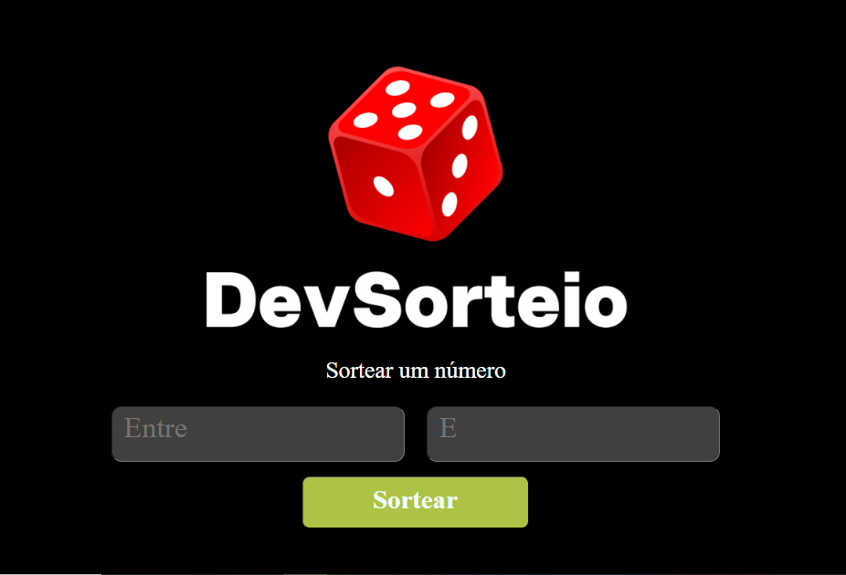

# 🎲 Sorteador de Números Aleatórios  

## 📌 Sobre o Projeto  
Este é um **sorteador de números aleatórios** que permite ao usuário definir um intervalo (mínimo e máximo) e obter um número aleatório dentro desse intervalo. O projeto foi desenvolvido para fins educacionais e de entretenimento.

---

## 🚀 Tecnologias Utilizadas  
- **HTML5** 🏗️  
- **CSS3** 🎨  
- **JavaScript (ES6+)** ⚡  

---

## 🎯 Funcionalidades  
✅ Permite ao usuário definir um intervalo mínimo e máximo  
✅ Gera um número aleatório dentro do intervalo definido  
✅ Interface simples e intuitiva  
✅ Feedback visual e interativo  

---

## 📸 Demonstração  
<div align="center">
  
</div>

---

## 🛠️ Como Executar o Projeto  

### 🔹 1. Clonar o Repositório  
```sh
git clone https://github.com/seu-usuario/sorteador-numeros.git
